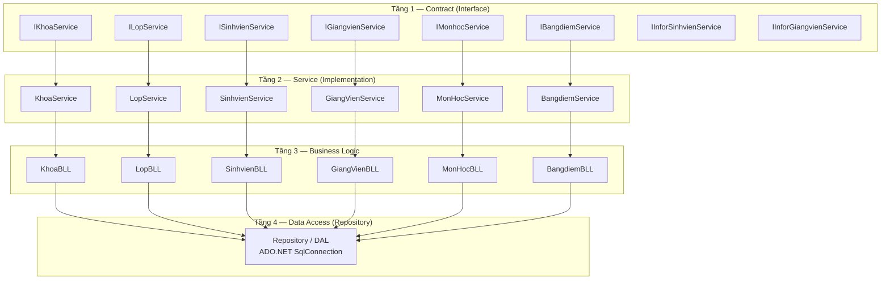
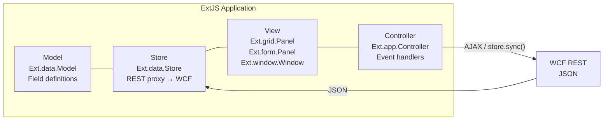
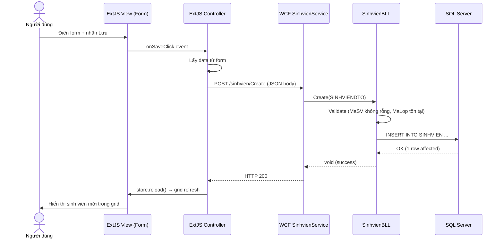
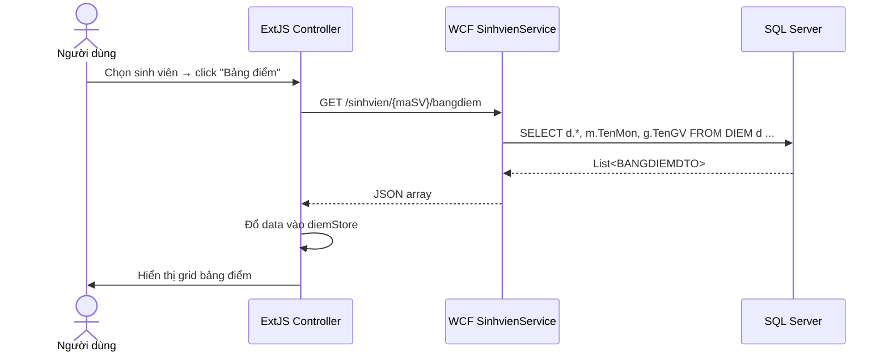

# Giải pháp & Kiến trúc

## 1. Tổng quan công nghệ

| Tầng | Công nghệ | Vai trò |
|---|---|---|
| **Presentation** | ExtJS Classic MVC | Grid, Form, Window — giao tiếp qua AJAX |
| **Service** | WCF REST, .NET 4.5.1 | Expose endpoint HTTP, serialize JSON |
| **Business** | C# BLL classes | Validate, enforce business rules |
| **Data Access** | Repository + ADO.NET | SQL queries tới SQL Server |
| **Database** | SQL Server | Lưu trữ quan hệ, khóa ngoại |

---

## 2. Kiến trúc 4 tầng Backend



---

## 3. Cấu trúc thư mục Backend

```
quanlysinhvien/
├── IServices/              # Tầng Contract (WCF interface)
│   ├── IKhoaService.cs
│   ├── ILopService.cs
│   ├── ISinhvienService.cs
│   ├── IGiangvienService.cs
│   ├── IMonhocService.cs
│   ├── IBangdiemService.cs
│   ├── IInforSinhvienService.cs
│   └── IInforGiangvienService.cs
│
├── Services/               # Tầng Service (triển khai IService)
│   ├── KhoaService.cs
│   ├── LopService.cs
│   ├── SinhvienService.cs
│   ├── GiangVienService.cs
│   ├── MonHocService.cs
│   ├── BangdiemService.cs
│   └── LogService.cs
│
├── Business/               # Tầng Business Logic
│   ├── KhoaBLL.cs
│   ├── LopBLL.cs
│   ├── SinhvienBLL.cs
│   ├── GiangVienBLL.cs
│   ├── MonHocBLL.cs
│   └── BangdiemBLL.cs
│
├── Models/                 # Entity + DTO
│   ├── KHOA.cs, KHOADTO.cs
│   ├── LOP.cs,  LOPDTO.cs
│   ├── SINHVIEN.cs, SINHVIENDTO.cs
│   ├── INFORSINHVIEN.cs, INFORSINHVIENDTO.cs
│   ├── GIANGVIEN.cs, GIANGVIENDTO.cs
│   ├── INFORGIANGVIEN.cs, INFORGIANGVIENDTO.cs
│   ├── MONHOC.cs, MONHOCDTO.cs
│   └── BANGDIEM.cs, BANGDIEMDTO.cs
│
└── web.config              # WCF endpoint config, connection string
```

---

## 4. Cấu hình WCF (web.config)

```xml
<system.serviceModel>
  <behaviors>
    <serviceBehaviors>
      <behavior>
        <serviceMetadata httpGetEnabled="true"/>
        <serviceDebug includeExceptionDetailInFaults="true"/>
      </behavior>
    </serviceBehaviors>
    <endpointBehaviors>
      <behavior name="webBehavior">
        <webHttp helpEnabled="true" defaultOutgoingResponseFormat="Json"/>
      </behavior>
    </endpointBehaviors>
  </behaviors>
  <services>
    <service name="quanlysinhvien.Services.SinhvienService">
      <endpoint address="" binding="webHttpBinding"
                contract="quanlysinhvien.IServices.ISinhvienService"
                behaviorConfiguration="webBehavior"/>
    </service>
    <!-- ... các service khác tương tự ... -->
  </services>
</system.serviceModel>
```

!!! info "webHttpBinding"
    `webHttpBinding` + `webHttp` behavior = REST endpoint với JSON serialize tự động.  
    Không dùng SOAP, không dùng `basicHttpBinding`.

---

## 5. Pattern Repository

```csharp
// BLL chỉ biết về business rules, không biết SQL
public class SinhvienBLL
{
    public List<SINHVIENDTO> GetAll()
    {
        // Gọi repository — không viết SQL ở đây
        return new SinhvienRepository().GetAll();
    }

    public void Create(SINHVIENDTO dto)
    {
        // Validate nghiệp vụ
        if (string.IsNullOrEmpty(dto.MaSV))
            throw new ArgumentException("Mã SV không được rỗng");

        new SinhvienRepository().Insert(dto);
    }
}

// Repository chứa SQL thuần
public class SinhvienRepository
{
    private string _connStr = ConfigurationManager.ConnectionStrings["QlSVDB"].ConnectionString;

    public List<SINHVIENDTO> GetAll()
    {
        var result = new List<SINHVIENDTO>();
        using (var conn = new SqlConnection(_connStr))
        {
            conn.Open();
            var cmd = new SqlCommand("SELECT MaSV, TenSV, NgaySinh, GioiTinh, MaLop FROM SINHVIEN", conn);
            var reader = cmd.ExecuteReader();
            while (reader.Read())
            {
                result.Add(new SINHVIENDTO {
                    MaSV     = reader["MaSV"].ToString(),
                    TenSV    = reader["TenSV"].ToString(),
                    NgaySinh = Convert.ToDateTime(reader["NgaySinh"]),
                    GioiTinh = Convert.ToBoolean(reader["GioiTinh"]),
                    MaLop    = reader["MaLop"].ToString()
                });
            }
        }
        return result;
    }
}
```

---

## 6. DTO Pattern

Mỗi entity có 2 class: **Entity** (ánh xạ DB) và **DTO** (truyền giữa tầng / sang client).

```csharp
// Entity — ánh xạ 1:1 với bảng DB
public class SINHVIEN
{
    public string MaSV    { get; set; }
    public string TenSV   { get; set; }
    public DateTime NgaySinh { get; set; }
    public bool GioiTinh  { get; set; }
    public string MaLop   { get; set; }
}

// DTO — [DataContract] để WCF serialize sang JSON
[DataContract]
public class SINHVIENDTO
{
    [DataMember] public string MaSV    { get; set; }
    [DataMember] public string TenSV   { get; set; }
    [DataMember] public DateTime NgaySinh { get; set; }
    [DataMember] public bool GioiTinh  { get; set; }
    [DataMember] public string MaLop   { get; set; }
}
```

!!! tip "Tại sao cần DTO?"
    DTO tách biệt cấu trúc truyền dữ liệu khỏi model DB.  
    Có thể thêm/bỏ field mà không ảnh hưởng đến bảng hoặc ngược lại.

---

## 7. Kiến trúc Frontend (ExtJS Classic MVC)



### Cấu trúc module

```
app/
├── khoa/
│   ├── model.js       # Ext.data.Model: MaKhoa, TenKhoa
│   ├── view.js        # Grid + Form + Toolbar
│   └── controller.js  # Handlers: add, edit, delete, reload
├── lop/
│   ├── model.js
│   ├── view.js
│   └── controller.js
├── sinhvien/
│   ├── model.js
│   ├── view.js        # Grid SV + Form SV + Tab thông tin mở rộng
│   └── controller.js
├── giangvien/
│   └── ...
├── monhoc/
│   └── ...
└── diem/
    └── ...
```

---

## 8. Luồng dữ liệu điển hình — Thêm sinh viên



---

## 9. Luồng dữ liệu — Xem bảng điểm sinh viên


