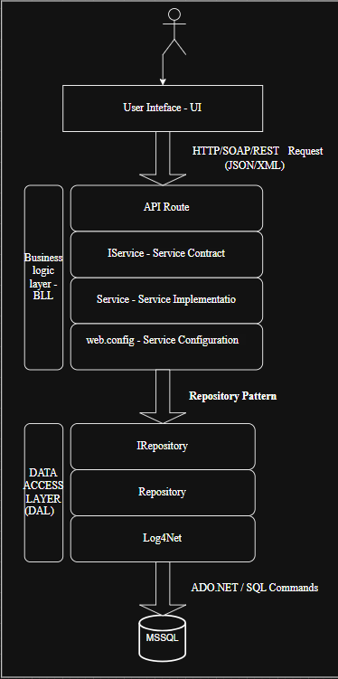
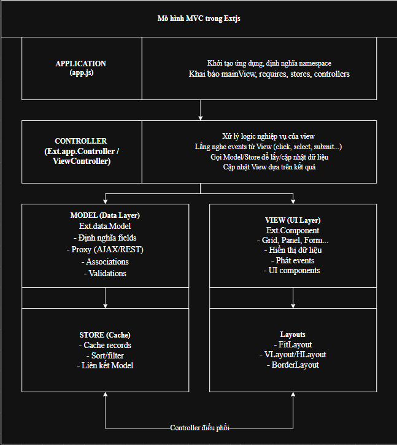

# Giải pháp công nghệ

Trang này mô tả kiến trúc tổng thể của hệ thống Quản lý sinh viên, các công nghệ được sử dụng, cấu trúc cơ sở dữ liệu và cách các module chính tương tác với nhau.

---

## 1. Nền tảng và công nghệ sử dụng

- Ngôn ngữ lập trình: C#  
- Nền tảng backend: .NET Framework 4.5.1  
- Kiểu backend: WCF Service Application, exposes các service để CRUD dữ liệu sinh viên, khoa, lớp, môn học, giảng viên, điểm.  
- Cơ sở dữ liệu: SQL Server, sử dụng các bảng KHOA, LOP, SINHVIEN, MONHOC, GIANGVIEN, INFORSINHVIEN, INFORGIANGVIEN, DIEM.  
- Frontend: ExtJS, tổ chức theo mô hình MVC (app/`<module>`/model.js, view.js, controller.js).  
- Công cụ phát triển: Visual Studio cho backend, trình duyệt + IDE (VS Code/WebStorm…) cho frontend.

---

## 2. Cơ sở dữ liệu

Hệ thống sử dụng cơ sở dữ liệu quan hệ để lưu trữ toàn bộ thông tin về khoa, lớp, sinh viên, giảng viên, môn học và điểm số. Mối quan hệ giữa các bảng được thiết kế để đảm bảo tính toàn vẹn dữ liệu (khóa chính/khóa ngoại) và hỗ trợ truy vấn linh hoạt.

```sql
create table KHOA
(
    MaKhoa char(15) primary key,
    TenKhoa nvarchar(100) not null
)
create table LOP(
    MaLop char(15) primary key,
    TenLop varchar(100) not null,
    MaKhoa char(15) not null,
    foreign key (MaKhoa) references KHOA(MaKhoa)
)
create table MONHOC(
    MaMon char(15) primary key,
    TenMon nvarchar(100) not null
)
create table SINHVIEN(
    MaSV char(15) primary key,
    TenSV nvarchar(100) not null,
    NgaySinh date not null,
    GioiTinh bit not null,
    MaLop char(15) not null,
    foreign key (MaLop) references LOP(MaLop)
)
create table INFORSINHVIEN(
    Id int identity(1,1) primary key,
    DiaChi nvarchar(200) not null,
    SDT char(15) not null,
    Email varchar(100) not null,
    DanToc nvarchar(50) not null,
    TonGiao nvarchar(50) null,
    MaSV char(15) not null,
    foreign key (MaSV) references SINHVIEN(MaSV)
)
create table GIANGVIEN(
    MaGV char(15) primary key,
    TenGV nvarchar(100) not null,
    NgaySinh date not null,
    GioiTinh bit not null,
    MaKhoa char(15) not null,
    foreign key (MaKhoa) references KHOA(MaKhoa)
)
create table INFORGIANGVIEN(
    Id int identity(1,1) primary key,
    DiaChi nvarchar(200) not null,
    SDT char(15) not null,
    Email varchar(100) not null,
    DanToc nvarchar(50) not null,
    TonGiao nvarchar(50) null,
    MaGV char(15) not null,
    foreign key (MaGV) references GIANGVIEN(MaGV)
)
create table DIEM(
    Id int identity(1,1) primary key,
    MaSV char(15) not null,
    MaMon char(15) not null,
    MaGV char(15) not null,
    DiemSo float not null,
    NamHoc char(9) not null,
    foreign key (MaSV) references SINHVIEN(MaSV),
    foreign key (MaMon) references MONHOC(MaMon),
    foreign key (MaGV) references GIANGVIEN(MaGV)
)
```

---

## 3. Mô hình kiến trúc backend

Backend được xây dựng dưới dạng WCF Service Application trên .NET Framework 4.5.1. Hệ thống chia thành các lớp chính: Contract, Service (Business), Data Access và Data Transfer Objects (DTO).



- Layer Contract: Định nghĩa các service contract (interface WCF) và data contract (DTO) cho các chức năng quản lý khoa, lớp, sinh viên, môn học, giảng viên, điểm.  
- Layer Service/Business: Cài đặt các service WCF, xử lý nghiệp vụ (kiểm tra ràng buộc, validate dữ liệu, gọi repository tương ứng).  
- Layer Data Access (Repository/DAL): Chịu trách nhiệm truy cập SQL Server, thực hiện các thao tác CRUD với các bảng KHOA, LOP, SINHVIEN, MONHOC, GIANGVIEN,…  
- Cấu hình WCF: sử dụng endpoint HTTP (hoặc TCP nếu có), cấu hình binding phù hợp để frontend ExtJS có thể gọi được qua AJAX/JSON.

WCF đóng vai trò trung gian, che giấu chi tiết lưu trữ dữ liệu và cung cấp các API thống nhất cho nhiều module giao diện.

---

## 4. Mô hình kiến trúc frontend

Frontend được phát triển bằng ExtJS theo mô hình MVC, giúp tách biệt rõ phần hiển thị, dữ liệu và xử lý sự kiện.



Cấu trúc thư mục chính:

- `app/khoa/model.js`, `app/khoa/view.js`, `app/khoa/controller.js`  
- `app/lop/model.js`, `app/lop/view.js`, `app/lop/controller.js`  
- `app/sinhvien/...`, `app/monhoc/...`, `app/giangvien/...`, `app/diem/...`

Trong đó:

- Model: định nghĩa cấu trúc dữ liệu (field, type) và cấu hình store để gọi tới WCF service (URL, phương thức, mapping JSON…).  
- View: các grid, form, window để hiển thị danh sách và chi tiết khoa, lớp, sinh viên, điểm,…  
- Controller: bắt sự kiện từ view (click, add, edit, delete), gọi store/load/save, gọi WCF service qua AJAX, xử lý kết quả và cập nhật lại giao diện.  

Nhờ áp dụng ExtJS MVC, từng module (khoa, lớp, sinh viên,…) được đóng gói riêng, dễ bảo trì và mở rộng.

---

## 5. Tương tác giữa các thành phần

Luồng xử lý điển hình khi người dùng thao tác trên giao diện ExtJS (ví dụ thêm sinh viên mới):

1. Người dùng mở màn hình “Quản lý sinh viên” (view ExtJS), nhập thông tin vào form và nhấn Lưu.  
2. Controller của module `sinhvien` bắt sự kiện, lấy dữ liệu từ form và gửi request AJAX/Store sync tới WCF service tương ứng.  
3. Service WCF nhận request, gọi lớp Business để kiểm tra ràng buộc (mã lớp tồn tại, định dạng email, ngày sinh hợp lệ, v.v.).  
4. Business gọi Repository/DAL để thực hiện câu lệnh INSERT/UPDATE trên SQL Server (bảng SINHVIEN, INFORSINHVIEN).  
5. WCF trả về kết quả (thành công/lỗi) dưới dạng JSON/XML, ExtJS xử lý response, hiển thị thông báo cho người dùng và cập nhật lại grid/list.  

Cách thiết kế này giúp tách biệt rõ giữa giao diện ExtJS, nghiệp vụ trong WCF và dữ liệu trong SQL Server, thuận tiện cho việc mở rộng hoặc thay đổi từng lớp trong tương lai.
