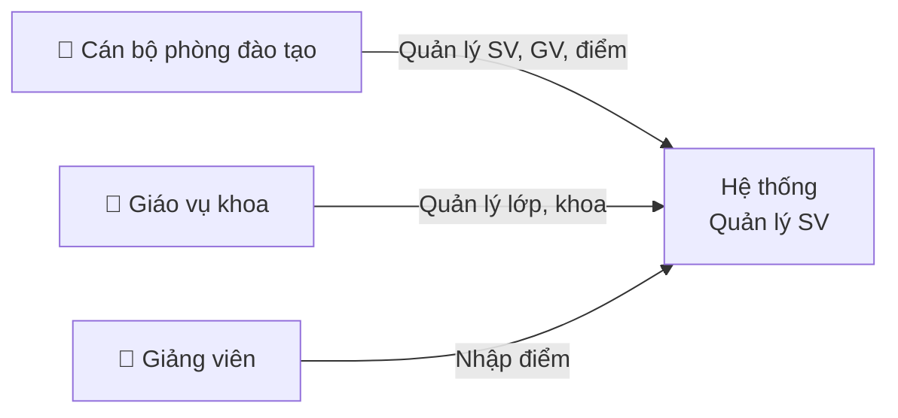
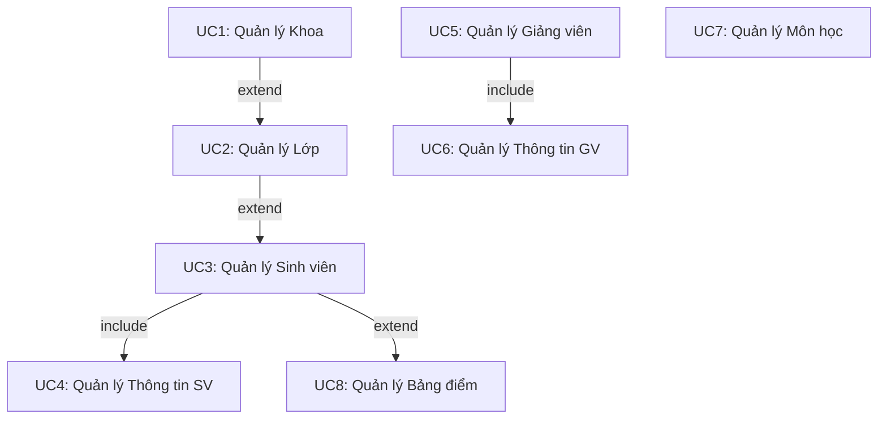

# Bài Toán

## Bối cảnh

Trong nhiều cơ sở giáo dục, thông tin sinh viên thường được quản lý rời rạc bằng Excel hoặc sổ giấy. Khi số lượng sinh viên tăng lên, cách làm thủ công này dẫn tới:

- Dữ liệu trùng lặp, sai sót khó phát hiện
- Tìm kiếm và báo cáo mất thời gian
- Cập nhật điểm, thông tin cá nhân không đồng bộ
- Không có lịch sử thay đổi dữ liệu

---

## Mục tiêu

Xây dựng hệ thống quản lý sinh viên tập trung với đầy đủ nghiệp vụ:

!!! success "Mục tiêu"
    - Lưu trữ và truy xuất thông tin sinh viên, giảng viên, khoa, lớp, môn học nhanh chóng
    - Cho phép nhập, sửa, xóa bảng điểm theo môn và năm học
    - Giao diện thống nhất, dễ sử dụng trên trình duyệt web
    - Kiến trúc phân tầng, dễ mở rộng thêm chức năng

---

## Actors — Đối tượng sử dụng

| Actor | Quyền hạn |
|---|---|
| Cán bộ phòng đào tạo | Full CRUD tất cả module |
| Giáo vụ khoa | CRUD lớp, sinh viên trong khoa |
| Giảng viên | Nhập / sửa điểm môn phụ trách |

---

## Use Cases chính

### Chi tiết từng Use Case

=== "UC1 — Khoa"
    | Bước | Mô tả |
    |---|---|
    | 1 | Người dùng mở module Khoa |
    | 2 | Xem danh sách khoa trong grid |
    | 3 | Thêm khoa mới: nhập Mã Khoa, Tên Khoa → Lưu |
    | 4 | Sửa thông tin khoa đã có |
    | 5 | Xóa khoa (nếu không còn lớp tham chiếu) |

=== "UC2 — Lớp"
    | Bước | Mô tả |
    |---|---|
    | 1 | Chọn module Lớp |
    | 2 | Danh sách lớp hiển thị kèm tên khoa |
    | 3 | Thêm lớp: chọn Khoa từ combobox, nhập Mã Lớp, Tên Lớp |
    | 4 | Sửa / xóa lớp |

=== "UC3 — Sinh viên"
    | Bước | Mô tả |
    |---|---|
    | 1 | Mở module Sinh Viên |
    | 2 | Grid hiển thị: Mã SV, Tên, Ngày sinh, Giới tính, Lớp |
    | 3 | Thêm mới: nhập thông tin → POST lên WCF |
    | 4 | Sửa: chọn row → form tự điền → PUT |
    | 5 | Xóa: chọn row → xác nhận → DELETE |
    | 6 | Xem bảng điểm của SV: GET /sinhvien/{id}/bangdiem |
    | 7 | Xem thông tin mở rộng: GET /sinhvien/{id}/infor |

=== "UC8 — Bảng điểm"
    | Bước | Mô tả |
    |---|---|
    | 1 | Mở module Bảng điểm |
    | 2 | Danh sách điểm với: Mã SV, Mã Môn, Giảng viên, Điểm, Năm học |
    | 3 | Nhập điểm mới: chọn SV, Môn, GV → nhập điểm → POST |
    | 4 | Sửa điểm: chọn record → PUT |
    | 5 | Xóa điểm |

---

## Yêu cầu phi chức năng

| Yêu cầu | Mô tả |
|---|---|
| **Tính nhất quán** | Khóa ngoại đảm bảo toàn vẹn dữ liệu giữa các bảng |
| **Hiệu năng** | Grid phân trang, không load toàn bộ dữ liệu một lần |
| **Mở rộng** | Kiến trúc 4 tầng giúp thêm module mới không ảnh hưởng phần còn lại |
| **Bảo trì** | Repository Pattern tách rời logic DB và nghiệp vụ |

---

## Phạm vi dự án

!!! note "Trong phạm vi"
    - CRUD đầy đủ 8 bảng: KHOA, LOP, SINHVIEN, INFORSINHVIEN, GIANGVIEN, INFORGIANGVIEN, MONHOC, DIEM
    - Giao diện ExtJS với Grid + Form
    - WCF REST API (JSON)
    - SQL Server với khóa ngoại

!!! warning "Ngoài phạm vi (chưa triển khai)"
    - Xác thực / phân quyền người dùng (Authentication / Authorization)
    - Báo cáo thống kê nâng cao
    - Export Excel / PDF
    - Tìm kiếm full-text
