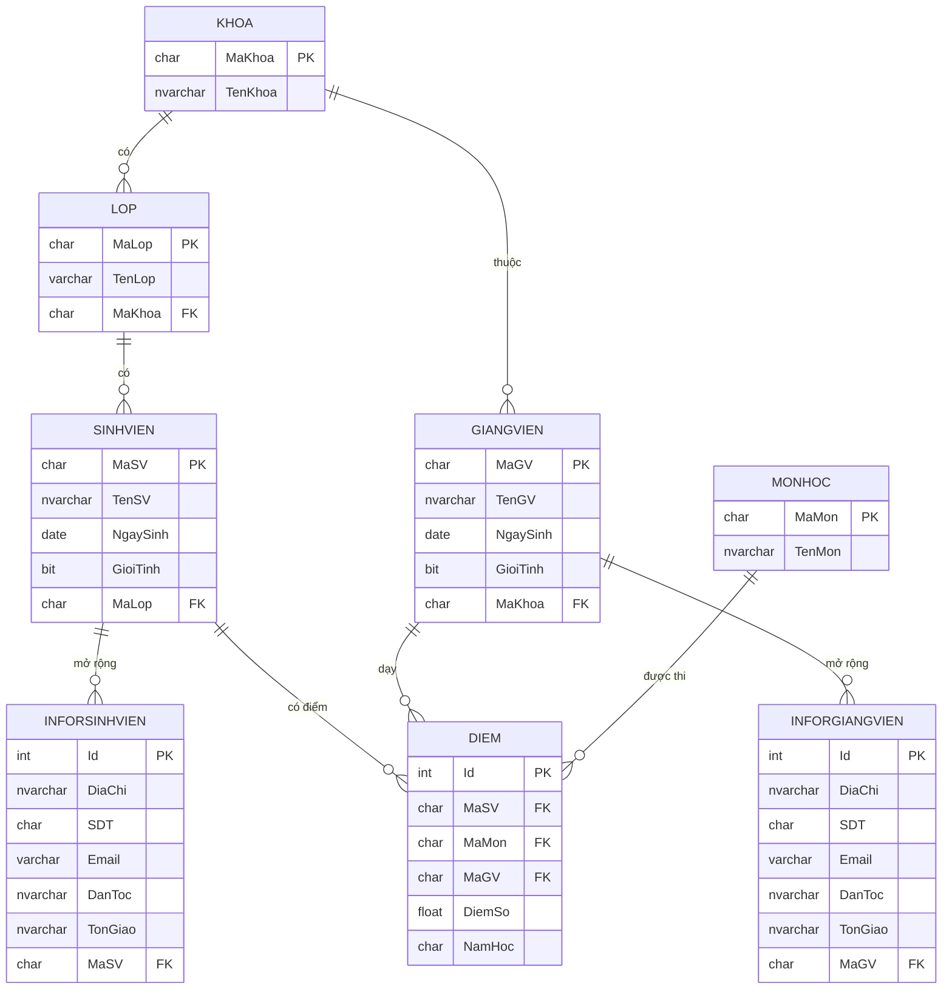

# Cơ Sở Dữ Liệu

## ERD — Sơ đồ quan hệ



---

## SQL CREATE — Toàn bộ schema

```sql
-- =============================================
-- KHOA — Khoa / Bộ môn
-- =============================================
CREATE TABLE KHOA (
    MaKhoa  CHAR(15)      PRIMARY KEY,
    TenKhoa NVARCHAR(100) NOT NULL
);

-- =============================================
-- LOP — Lớp học
-- =============================================
CREATE TABLE LOP (
    MaLop  CHAR(15)     PRIMARY KEY,
    TenLop VARCHAR(100) NOT NULL,
    MaKhoa CHAR(15)     NOT NULL,
    FOREIGN KEY (MaKhoa) REFERENCES KHOA(MaKhoa)
);

-- =============================================
-- MONHOC — Môn học
-- =============================================
CREATE TABLE MONHOC (
    MaMon  CHAR(15)      PRIMARY KEY,
    TenMon NVARCHAR(100) NOT NULL
);

-- =============================================
-- SINHVIEN — Sinh viên (thông tin cơ bản)
-- =============================================
CREATE TABLE SINHVIEN (
    MaSV     CHAR(15)      PRIMARY KEY,
    TenSV    NVARCHAR(100) NOT NULL,
    NgaySinh DATE          NOT NULL,
    GioiTinh BIT           NOT NULL,   -- 1 = Nam, 0 = Nữ
    MaLop    CHAR(15)      NOT NULL,
    FOREIGN KEY (MaLop) REFERENCES LOP(MaLop)
);

-- =============================================
-- INFORSINHVIEN — Thông tin mở rộng sinh viên
-- =============================================
CREATE TABLE INFORSINHVIEN (
    Id      INT IDENTITY(1,1) PRIMARY KEY,
    DiaChi  NVARCHAR(200)     NOT NULL,
    SDT     CHAR(15)          NOT NULL,
    Email   VARCHAR(100)      NOT NULL,
    DanToc  NVARCHAR(50)      NOT NULL,
    TonGiao NVARCHAR(50)      NULL,
    MaSV    CHAR(15)          NOT NULL,
    FOREIGN KEY (MaSV) REFERENCES SINHVIEN(MaSV)
);

-- =============================================
-- GIANGVIEN — Giảng viên (thông tin cơ bản)
-- =============================================
CREATE TABLE GIANGVIEN (
    MaGV     CHAR(15)      PRIMARY KEY,
    TenGV    NVARCHAR(100) NOT NULL,
    NgaySinh DATE          NOT NULL,
    GioiTinh BIT           NOT NULL,
    MaKhoa   CHAR(15)      NOT NULL,
    FOREIGN KEY (MaKhoa) REFERENCES KHOA(MaKhoa)
);

-- =============================================
-- INFORGIANGVIEN — Thông tin mở rộng giảng viên
-- =============================================
CREATE TABLE INFORGIANGVIEN (
    Id      INT IDENTITY(1,1) PRIMARY KEY,
    DiaChi  NVARCHAR(200)     NOT NULL,
    SDT     CHAR(15)          NOT NULL,
    Email   VARCHAR(100)      NOT NULL,
    DanToc  NVARCHAR(50)      NOT NULL,
    TonGiao NVARCHAR(50)      NULL,
    MaGV    CHAR(15)          NOT NULL,
    FOREIGN KEY (MaGV) REFERENCES GIANGVIEN(MaGV)
);

-- =============================================
-- DIEM — Bảng điểm (SV x Môn x GV x Năm học)
-- =============================================
CREATE TABLE DIEM (
    Id      INT IDENTITY(1,1) PRIMARY KEY,
    MaSV    CHAR(15)          NOT NULL,
    MaMon   CHAR(15)          NOT NULL,
    MaGV    CHAR(15)          NOT NULL,
    DiemSo  FLOAT             NOT NULL,
    NamHoc  CHAR(9)           NOT NULL,   -- VD: '2024-2025'
    FOREIGN KEY (MaSV)  REFERENCES SINHVIEN(MaSV),
    FOREIGN KEY (MaMon) REFERENCES MONHOC(MaMon),
    FOREIGN KEY (MaGV)  REFERENCES GIANGVIEN(MaGV)
);
```

---

## Mô tả từng bảng

=== "KHOA"
    | Cột | Kiểu | Ràng buộc | Mô tả |
    |---|---|---|---|
    | `MaKhoa` | CHAR(15) | PK | Mã khoa, ví dụ `'CNTT'` |
    | `TenKhoa` | NVARCHAR(100) | NOT NULL | Tên đầy đủ khoa |

=== "LOP"
    | Cột | Kiểu | Ràng buộc | Mô tả |
    |---|---|---|---|
    | `MaLop` | CHAR(15) | PK | Mã lớp, ví dụ `'CT22A'` |
    | `TenLop` | VARCHAR(100) | NOT NULL | Tên lớp |
    | `MaKhoa` | CHAR(15) | FK → KHOA | Lớp thuộc khoa nào |

=== "SINHVIEN"
    | Cột | Kiểu | Ràng buộc | Mô tả |
    |---|---|---|---|
    | `MaSV` | CHAR(15) | PK | Mã sinh viên, ví dụ `'SV001'` |
    | `TenSV` | NVARCHAR(100) | NOT NULL | Họ và tên |
    | `NgaySinh` | DATE | NOT NULL | Ngày sinh |
    | `GioiTinh` | BIT | NOT NULL | 1 = Nam, 0 = Nữ |
    | `MaLop` | CHAR(15) | FK → LOP | Thuộc lớp nào |

=== "DIEM"
    | Cột | Kiểu | Ràng buộc | Mô tả |
    |---|---|---|---|
    | `Id` | INT | PK, IDENTITY | Auto-increment |
    | `MaSV` | CHAR(15) | FK → SINHVIEN | Sinh viên nào |
    | `MaMon` | CHAR(15) | FK → MONHOC | Môn học nào |
    | `MaGV` | CHAR(15) | FK → GIANGVIEN | Giảng viên chấm |
    | `DiemSo` | FLOAT | NOT NULL | Điểm số (ví dụ 8.5) |
    | `NamHoc` | CHAR(9) | NOT NULL | Năm học, ví dụ `'2024-2025'` |

---

## Quan hệ giữa các bảng

```
KHOA (1) ──────< LOP (nhiều)
                  LOP (1) ──────< SINHVIEN (nhiều)
                                   SINHVIEN (1) ──────< INFORSINHVIEN (nhiều)
                                   SINHVIEN (1) ──────< DIEM (nhiều)

KHOA (1) ──────< GIANGVIEN (nhiều)
                  GIANGVIEN (1) ──────< INFORGIANGVIEN (nhiều)
                  GIANGVIEN (1) ──────< DIEM (nhiều)

MONHOC (1) ────< DIEM (nhiều)
```

!!! info "INFORSINHVIEN / INFORGIANGVIEN"
    Thiết kế tách thông tin mở rộng (địa chỉ, SDT, email, dân tộc, tôn giáo) sang bảng riêng.  
    Lý do: thông tin này có thể null hoặc có nhiều bản ghi theo thời gian.

---

## Dữ liệu mẫu

```sql
-- Khoa
INSERT INTO KHOA VALUES ('CNTT', N'Công nghệ thông tin');
INSERT INTO KHOA VALUES ('KTKT', N'Kế toán kiểm toán');

-- Lớp
INSERT INTO LOP VALUES ('CT22A', N'Công nghệ 22A', 'CNTT');
INSERT INTO LOP VALUES ('CT22B', N'Công nghệ 22B', 'CNTT');

-- Sinh viên
INSERT INTO SINHVIEN VALUES ('SV001', N'Nguyễn Văn An', '2003-05-15', 1, 'CT22A');
INSERT INTO SINHVIEN VALUES ('SV002', N'Trần Thị Bình',  '2003-08-22', 0, 'CT22A');

-- Môn học
INSERT INTO MONHOC VALUES ('LTCB', N'Lập trình cơ bản');
INSERT INTO MONHOC VALUES ('CSDL', N'Cơ sở dữ liệu');

-- Điểm
INSERT INTO DIEM VALUES ('SV001', 'LTCB', 'GV001', 8.5, '2024-2025');
INSERT INTO DIEM VALUES ('SV001', 'CSDL', 'GV002', 7.0, '2024-2025');
```
