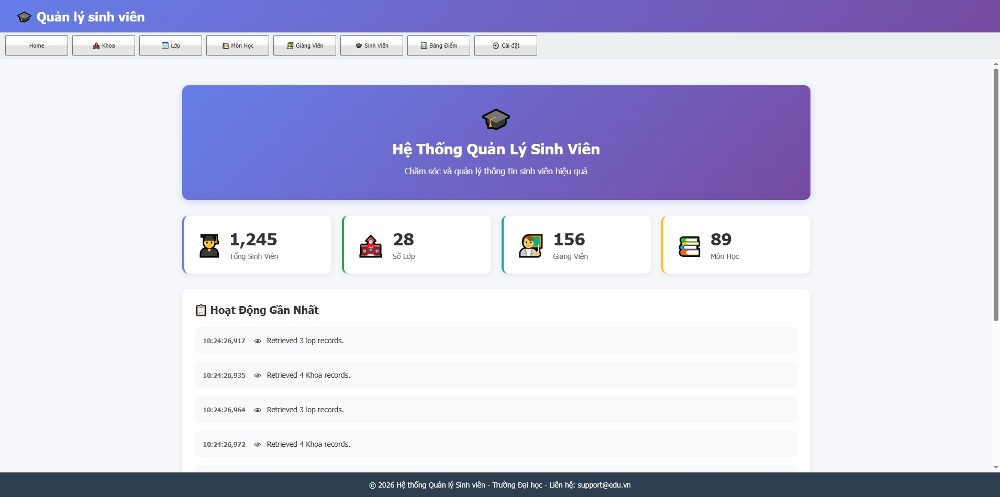
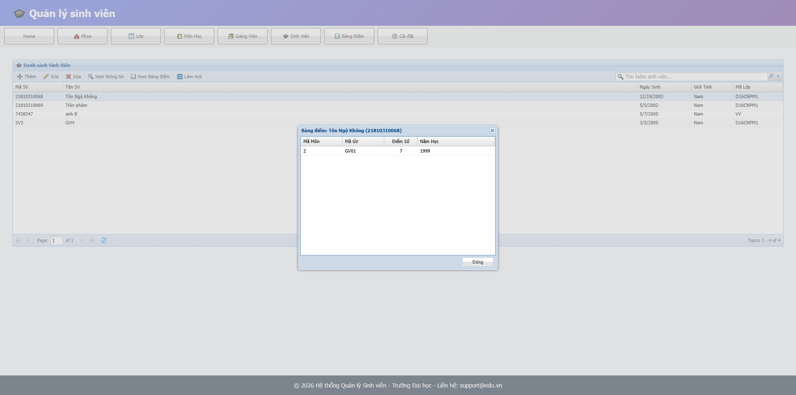

# Giao diện

Trang này minh hoạ các màn hình chính của hệ thống Quản lý sinh viên được xây dựng bằng ExtJS, bao gồm màn hình đăng nhập, danh sách sinh viên, thêm/sửa sinh viên và tìm kiếm.

---

## 1. Màn hình chính / Dashboard

Màn hình chính hiển thị thanh menu hoặc các nút chức năng cho phép người dùng truy cập nhanh tới các module quản lý: khoa, lớp, sinh viên, giảng viên, môn học và điểm.  
Tại đây người dùng có thể xem tổng quan số lượng sinh viên, lớp hoặc các thông tin thống kê cơ bản (nếu có).

---

## 2. Màn hình quản lý sinh viên

Màn hình quản lý sinh viên được xây dựng dưới dạng lưới (Ext.grid.Panel) kết hợp với form chi tiết:

- Phần lưới hiển thị danh sách sinh viên với các cột cơ bản như: Mã SV, Tên SV, Ngày sinh, Giới tính, Lớp, Khoa,…  
- Phần form cho phép thêm mới hoặc chỉnh sửa thông tin sinh viên (họ tên, ngày sinh, giới tính, địa chỉ, số điện thoại, email, dân tộc, tôn giáo,…).  
- Thanh công cụ (toolbar) hỗ trợ các thao tác: thêm, sửa, xoá, lưu, làm mới dữ liệu.

---

## 3. Chức năng tìm kiếm và lọc

Trên màn hình danh sách sinh viên có ô tìm kiếm và/hoặc các combobox lọc theo Khoa, Lớp, Năm học,…  
Người dùng nhập từ khoá (tên, mã sinh viên, email,…) hoặc chọn tiêu chí lọc, ExtJS sẽ gửi yêu cầu tới WCF service để lấy danh sách kết quả phù hợp và cập nhật lại lưới.

---

## 4. Các màn hình khác

Ngoài màn hình sinh viên, hệ thống còn có các giao diện tương tự cho:

- Quản lý khoa và lớp.  
- Quản lý môn học và điểm.  
- Quản lý thông tin giảng viên.

Các màn hình này đều tuân theo cùng một mẫu: lưới dữ liệu kết hợp form chi tiết, giúp giao diện thống nhất, dễ sử dụng và dễ mở rộng thêm chức năng trong tương lai.
