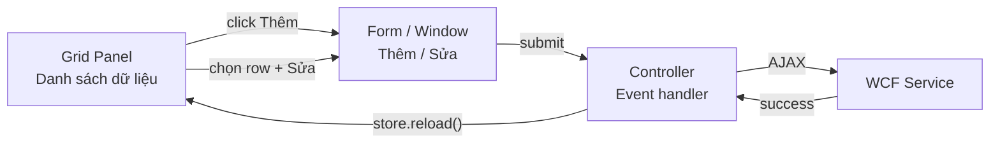

# Giao Diện

Tổng quan màn hình và layout của từng module trong hệ thống.

---

## Layout tổng thể

```
┌──────────────────────────────────────────────────────────────┐
│  Header — Logo + Tên hệ thống                                │
├─────────────────┬────────────────────────────────────────────┤
│  Menu bên trái  │  Vùng nội dung chính (Ext.panel.Panel)     │
│                 │                                            │
│  - Khoa         │  ┌──────────────────────────────────────┐  │
│  - Lớp          │  │  Toolbar: [Thêm] [Sửa] [Xóa] [Làm]  │  │
│  - Sinh viên    │  ├──────────────────────────────────────┤  │
│  - Giảng viên   │  │  Grid — danh sách dữ liệu            │  │
│  - Môn học      │  │  (phân trang, sắp xếp, tìm kiếm)    │  │
│  - Bảng điểm    │  └──────────────────────────────────────┘  │
│                 │                                            │
└─────────────────┴────────────────────────────────────────────┘
```

---

## Module Khoa & Lớp

```
┌─────────────────────────────────────────────────────┐
│  Quản lý Khoa                                       │
│  [+ Thêm]  [✏ Sửa]  [🗑 Xóa]  [↻ Làm mới]         │
├──────────────┬──────────────────────────────────────┤
│  Mã Khoa     │  Tên Khoa                            │
├──────────────┼──────────────────────────────────────┤
│  CNTT        │  Công nghệ thông tin                 │
│  KTKT        │  Kế toán kiểm toán                   │
│  ...         │  ...                                 │
└──────────────┴──────────────────────────────────────┘

  Khi nhấn Thêm / Sửa → Form popup hiện:
  ┌────────────────────────────────────────┐
  │  Thêm khoa mới                    [✕]  │
  │  Mã Khoa:  [____________]              │
  │  Tên Khoa: [____________]              │
  │             [Lưu]  [Hủy]              │
  └────────────────────────────────────────┘
```

Module **Lớp** có thêm combobox chọn Khoa (load từ `KhoaService.svc/GetAll`).

---

## Module Sinh Viên

```
┌────────────────────────────────────────────────────────────────┐
│  Quản lý Sinh Viên                                             │
│  [+ Thêm]  [✏ Sửa]  [🗑 Xóa]  [📋 Bảng điểm]  [ℹ Thông tin] │
├────────┬──────────────────┬────────────┬──────────┬────────────┤
│  Mã SV │  Họ và Tên       │  Ngày sinh │  Giới t. │  Lớp       │
├────────┼──────────────────┼────────────┼──────────┼────────────┤
│  SV001 │  Nguyễn Văn An   │  15/05/03  │  Nam     │  CT22A     │
│  SV002 │  Trần Thị Bình   │  22/08/03  │  Nữ      │  CT22A     │
└────────┴──────────────────┴────────────┴──────────┴────────────┘

  Form thêm/sửa SV:
  ┌──────────────────────────────────────────────┐
  │  Thông tin sinh viên                    [✕]  │
  │  Mã SV:     [__________]                     │
  │  Họ tên:    [__________]                     │
  │  Ngày sinh: [__________]  (DateField)        │
  │  Giới tính: ● Nam  ○ Nữ   (RadioGroup)       │
  │  Lớp:       [▼ CT22A   ]  (ComboBox)         │
  │              [Lưu]  [Hủy]                    │
  └──────────────────────────────────────────────┘
```

### Xem bảng điểm sinh viên

Chọn SV → click **Bảng điểm** → popup grid:

```
┌───────────────────────────────────────────────────────────────┐
│  Bảng điểm — Nguyễn Văn An (SV001)                      [✕]  │
├──────────────────┬──────────────────┬─────────┬──────────────┤
│  Môn học         │  Giảng viên      │  Điểm   │  Năm học     │
├──────────────────┼──────────────────┼─────────┼──────────────┤
│  Lập trình CB    │  Nguyễn Thị Lan  │  8.5    │  2024-2025   │
│  Cơ sở dữ liệu  │  Trần Văn Minh   │  7.0    │  2024-2025   │
└──────────────────┴──────────────────┴─────────┴──────────────┘
```

---

## Module Giảng Viên

```
┌────────────────────────────────────────────────────────┐
│  Quản lý Giảng Viên                                    │
│  [+ Thêm]  [✏ Sửa]  [🗑 Xóa]  [ℹ Thông tin mở rộng]  │
├────────┬─────────────────┬────────────┬──────────┬─────┤
│  Mã GV │  Họ và Tên      │  Ngày sinh │  Giới t. │Khoa │
├────────┼─────────────────┼────────────┼──────────┼─────┤
│  GV001 │  Nguyễn Thị Lan │  12/03/80  │  Nữ      │CNTT │
│  GV002 │  Trần Văn Minh  │  05/07/75  │  Nam     │CNTT │
└────────┴─────────────────┴────────────┴──────────┴─────┘
```

Form tương tự sinh viên, combobox chọn Khoa thay vì Lớp.

---

## Module Môn Học

```
┌───────────────────────────────────┐
│  Quản lý Môn Học                  │
│  [+ Thêm]  [✏ Sửa]  [🗑 Xóa]    │
├──────────────┬────────────────────┤
│  Mã Môn      │  Tên Môn           │
├──────────────┼────────────────────┤
│  LTCB        │  Lập trình cơ bản  │
│  CSDL        │  Cơ sở dữ liệu     │
└──────────────┴────────────────────┘
```

---

## Module Bảng Điểm

```
┌──────────────────────────────────────────────────────────────────┐
│  Quản lý Bảng Điểm                                               │
│  [+ Nhập điểm]  [✏ Sửa]  [🗑 Xóa]  [↻ Làm mới]                 │
├────────┬──────────┬──────────────────┬─────────┬────────────────┤
│  Mã SV │  Mã Môn  │  Giảng viên      │  Điểm   │  Năm học       │
├────────┼──────────┼──────────────────┼─────────┼────────────────┤
│  SV001 │  LTCB    │  Nguyễn Thị Lan  │  8.5    │  2024-2025     │
│  SV002 │  CSDL    │  Trần Văn Minh   │  7.0    │  2024-2025     │
└────────┴──────────┴──────────────────┴─────────┴────────────────┘

  Form nhập điểm:
  ┌──────────────────────────────────────────┐
  │  Nhập điểm                          [✕]  │
  │  Sinh viên:   [▼ SV001 — Nguyễn Văn An] │
  │  Môn học:     [▼ LTCB — Lập trình CB  ] │
  │  Giảng viên:  [▼ GV001 — Nguyễn Thị L ] │
  │  Điểm số:     [8.5]                      │
  │  Năm học:     [2024-2025]                │
  │               [Lưu]  [Hủy]              │
  └──────────────────────────────────────────┘
```

---

## Thông tin mở rộng (SV / GV)

Cả sinh viên và giảng viên đều có tab thông tin mở rộng:

```
┌────────────────────────────────────────────────────┐
│  Thông tin chi tiết — Nguyễn Văn An           [✕]  │
│  ─────────────────────────────────────────────────  │
│  Địa chỉ:   [12 Trần Hưng Đạo, Hà Nội       ]    │
│  SDT:       [0987654321                      ]    │
│  Email:     [nguyenvanan@email.com           ]    │
│  Dân tộc:   [Kinh                            ]    │
│  Tôn giáo:  [Không                          ]    │
│                          [Lưu]  [Hủy]            │
└────────────────────────────────────────────────────┘
```

---

## Pattern giao diện chung

Tất cả module tuân theo **cùng một pattern**:



!!! tip "Tái sử dụng pattern"
    Mỗi module có cùng cấu trúc: `model.js` → `view.js` (Grid + Form) → `controller.js`.  
    Khi thêm module mới, chỉ cần copy và thay đổi field names + URL.
