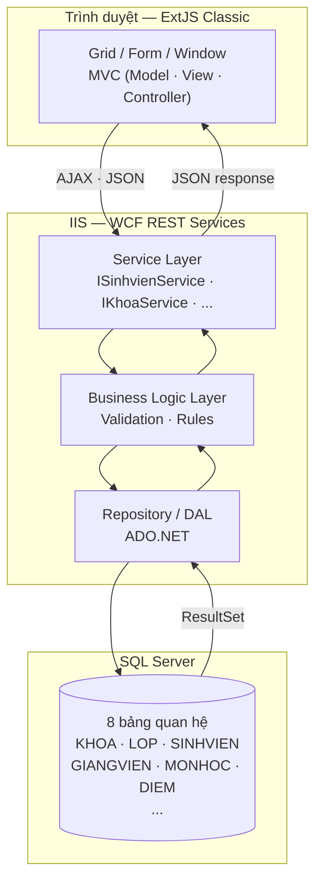

# Hệ thống Quản lý Sinh Viên

Tài liệu kỹ thuật toàn diện cho hệ thống **Quản lý Sinh Viên** — xây dựng trên nền tảng WCF REST (.NET 4.5.1), ExtJS Classic MVC và SQL Server.

> **Tác giả:** Giang Văn Hưng &nbsp;|&nbsp; **Thời gian:** 8/6/2026 – 12/6/2026

---

## Tổng quan kiến trúc

---

## Tech stack

| Tầng | Công nghệ | Chi tiết |
|---|---|---|
| **Frontend** | ExtJS (Classic toolkit) | MVC pattern, Store + Proxy REST, Grid, Form |
| **Backend** | WCF REST, .NET 4.5.1, C# | `webHttpBinding`, `WebGet`/`WebInvoke`, JSON |
| **Database** | SQL Server | ADO.NET thuần, không dùng ORM |
| **Hosting** | IIS / IIS Express | `web.config` serviceModel config |
| **Dev tools** | Visual Studio, Postman | WCF Test Client, Browser DevTools |

---

## Các module

| Module | Bảng DB | Service |
|---|---|---|
| Khoa | `KHOA` | `IKhoaService` |
| Lớp | `LOP` | `ILopService` |
| Sinh viên | `SINHVIEN`, `INFORSINHVIEN` | `ISinhvienService`, `IInforSinhvienService` |
| Giảng viên | `GIANGVIEN`, `INFORGIANGVIEN` | `IGiangvienService`, `IInforGiangvienService` |
| Môn học | `MONHOC` | `IMonhocService` |
| Bảng điểm | `DIEM` | `IBangdiemService` |

---

## Điểm bắt đầu nhanh

1. [Bài toán](baitoan.md) — Phân tích yêu cầu, actors, use cases
2. [Giải pháp & Kiến trúc](Giaiphapcongnghe.md) — 4-tier, luồng dữ liệu, sequence diagram
3. [Cơ sở dữ liệu](database.md) — ERD, SQL CREATE, quan hệ bảng
4. [API Reference](api.md) — Tất cả 8 WCF service endpoints
5. [Giao diện](giaodien.md) — Layout, màn hình từng module
6. [Kiến thức kỹ thuật](kienthuc.md) — Patterns, gotchas, tips debug
