# Kiến Thức Kỹ Thuật

Tổng hợp kiến thức, patterns và gotchas trong quá trình xây dựng hệ thống.

---

## 1. WCF REST — Những điểm quan trọng

### webHttpBinding vs basicHttpBinding

!!! danger "Không dùng basicHttpBinding cho REST/JSON"
    `basicHttpBinding` = SOAP. Dùng `webHttpBinding` + `webHttp` behavior mới ra JSON.

```xml
<!-- ĐÚNG cho REST -->
<binding name="webHttpBinding" />
<behavior name="webBehavior">
    <webHttp defaultOutgoingResponseFormat="Json" helpEnabled="true"/>
</behavior>
```

---

### [WebGet] vs [WebInvoke]

```csharp
// Read-only → [WebGet]
[WebGet(UriTemplate = "GetAll", ResponseFormat = WebMessageFormat.Json)]
List<SINHVIENDTO> GetAll();

[WebGet(UriTemplate = "GetById/{id}", ResponseFormat = WebMessageFormat.Json)]
SINHVIENDTO GetById(string id);  // id trong UriTemplate phải là string

// Write operations → [WebInvoke]
[WebInvoke(Method = "POST", UriTemplate = "Create",
    RequestFormat  = WebMessageFormat.Json,
    ResponseFormat = WebMessageFormat.Json)]
void Create(SINHVIENDTO dto);

[WebInvoke(Method = "PUT", UriTemplate = "Update/{id}", ...)]
void Update(string id, SINHVIENDTO dto);

[WebInvoke(Method = "DELETE", UriTemplate = "Delete/{id}", ...)]
void Delete(string id);
```

!!! warning "UriTemplate param phải là string"
    Các param trong UriTemplate (`{id}`, `{maSV}`) phải là `string` trong C#.  
    WCF không tự convert từ path string sang `int`.

---

### DateTime serialization

WCF `DataContractJsonSerializer` serialize `DateTime` thành format `/Date(ms)/`:

```json
"NgaySinh": "\/Date(1052956800000)\/"
```

**ExtJS parse:**
```javascript
// Trong model definition
fields: [
    { name: 'NgaySinh', type: 'date', dateFormat: 'MS' }
    // 'MS' = Microsoft JSON Date format
]
```

---

### CORS — Cross-Origin Request

Nếu ExtJS và WCF chạy trên khác port, cần enable CORS trong `web.config`:

```xml
<system.webServer>
  <httpProtocol>
    <customHeaders>
      <add name="Access-Control-Allow-Origin"  value="*"/>
      <add name="Access-Control-Allow-Methods" value="GET, POST, PUT, DELETE, OPTIONS"/>
      <add name="Access-Control-Allow-Headers" value="Content-Type"/>
    </customHeaders>
  </httpProtocol>
</system.webServer>
```

---

## 2. ADO.NET — Repository Pattern

### Cấu trúc SqlConnection đúng

```csharp
// Luôn dùng using để đảm bảo connection đóng
public SINHVIENDTO GetById(string maSV)
{
    using (var conn = new SqlConnection(_connStr))
    {
        conn.Open();
        var cmd = new SqlCommand(
            "SELECT * FROM SINHVIEN WHERE MaSV = @MaSV", conn);
        cmd.Parameters.AddWithValue("@MaSV", maSV);

        using (var reader = cmd.ExecuteReader())
        {
            if (reader.Read())
            {
                return new SINHVIENDTO {
                    MaSV     = reader["MaSV"].ToString(),
                    TenSV    = reader["TenSV"].ToString(),
                    NgaySinh = Convert.ToDateTime(reader["NgaySinh"]),
                    GioiTinh = Convert.ToBoolean(reader["GioiTinh"]),
                    MaLop    = reader["MaLop"].ToString()
                };
            }
        }
    }
    return null;
}
```

!!! danger "SQL Injection"
    Luôn dùng `@Parameter` + `AddWithValue`. Không nối chuỗi trực tiếp vào SQL.

---

### Kiểm tra row affected

```csharp
public bool Delete(string maSV)
{
    using (var conn = new SqlConnection(_connStr))
    {
        conn.Open();
        var cmd = new SqlCommand(
            "DELETE FROM SINHVIEN WHERE MaSV = @MaSV", conn);
        cmd.Parameters.AddWithValue("@MaSV", maSV);

        int rows = cmd.ExecuteNonQuery();
        return rows > 0;  // false nếu không tìm thấy record
    }
}
```

---

### FK Constraint — Xóa dây chuyền

Không thể xóa **SINHVIEN** khi còn record trong **DIEM** hoặc **INFORSINHVIEN**.  
Phải xóa các bảng con trước, hoặc dùng `ON DELETE CASCADE`.

```sql
-- Option 1: Xóa thủ công từ BLL
DELETE FROM INFORSINHVIEN WHERE MaSV = @MaSV;
DELETE FROM DIEM WHERE MaSV = @MaSV;
DELETE FROM SINHVIEN WHERE MaSV = @MaSV;

-- Option 2: CASCADE (trong CREATE TABLE)
FOREIGN KEY (MaSV) REFERENCES SINHVIEN(MaSV) ON DELETE CASCADE
```

---

## 3. ExtJS Classic — Những điểm quan trọng

### Store + REST Proxy

```javascript
Ext.define('App.model.SinhVien', {
    extend: 'Ext.data.Model',
    fields: [
        { name: 'MaSV',     type: 'string' },
        { name: 'TenSV',    type: 'string' },
        { name: 'NgaySinh', type: 'date', dateFormat: 'MS' },
        { name: 'GioiTinh', type: 'boolean' },
        { name: 'MaLop',    type: 'string' }
    ]
});

Ext.define('App.store.SinhVien', {
    extend: 'Ext.data.Store',
    model: 'App.model.SinhVien',
    proxy: {
        type:   'rest',
        url:    'http://localhost:PORT/SinhvienService.svc/',
        reader: { type: 'json', rootProperty: '' },
        writer: { type: 'json' }
    },
    autoLoad: true
});
```

!!! warning "rootProperty"
    WCF trả về JSON array trực tiếp (không có wrapper object), nên `rootProperty: ''`.  
    Nếu dùng `rootProperty: 'data'`, ExtJS sẽ không đọc được gì.

---

### Grid Panel cơ bản

```javascript
Ext.define('App.view.SinhVienGrid', {
    extend: 'Ext.grid.Panel',
    store: 'App.store.SinhVien',
    columns: [
        { text: 'Mã SV',    dataIndex: 'MaSV',     flex: 1 },
        { text: 'Họ tên',   dataIndex: 'TenSV',     flex: 2 },
        { text: 'Ngày sinh',dataIndex: 'NgaySinh',  flex: 1,
          renderer: Ext.util.Format.dateRenderer('d/m/Y') },
        { text: 'Giới tính',dataIndex: 'GioiTinh',  flex: 1,
          renderer: function(v) { return v ? 'Nam' : 'Nữ'; } },
        { text: 'Lớp',      dataIndex: 'MaLop',     flex: 1 }
    ],
    tbar: [
        { text: 'Thêm', iconCls: 'x-fa fa-plus',   handler: 'onAdd' },
        { text: 'Sửa',  iconCls: 'x-fa fa-edit',   handler: 'onEdit' },
        { text: 'Xóa',  iconCls: 'x-fa fa-trash',  handler: 'onDelete' }
    ]
});
```

---

### ComboBox load từ WCF

```javascript
{
    xtype: 'combobox',
    fieldLabel: 'Lớp',
    displayField: 'TenLop',
    valueField:   'MaLop',
    store: {
        fields: ['MaLop', 'TenLop'],
        proxy: {
            type:   'ajax',
            url:    'http://localhost:PORT/LopService.svc/GetAll',
            reader: { type: 'json', rootProperty: '' }
        },
        autoLoad: true
    }
}
```

---

### AJAX request thủ công

```javascript
// Khi cần control tốt hơn store
Ext.Ajax.request({
    url:      'http://localhost:PORT/SinhvienService.svc/Create',
    method:   'POST',
    headers:  { 'Content-Type': 'application/json' },
    jsonData: rec.getData(),
    success: function(response) {
        var data = Ext.decode(response.responseText);
        store.reload();
        Ext.Msg.alert('Thành công', 'Đã thêm sinh viên');
    },
    failure: function(response) {
        Ext.Msg.alert('Lỗi', 'Không thể kết nối đến server');
    }
});
```

---

## 4. Quy trình phát triển (Full-stack Workflow)

```mermaid
flowchart LR
    A["1. Thiết kế DB\nSQL CREATE TABLE"] -->
    B["2. Tạo Entity\n& DTO (C#)"] -->
    C["3. Viết Repository\nADO.NET SQL"] -->
    D["4. Viết BLL\nValidation"] -->
    E["5. Viết WCF Service\n[ServiceContract]"] -->
    F["6. Cấu hình web.config\nendpoint + binding"] -->
    G["7. Test với Postman\nhoặc WCF Test Client"] -->
    H["8. Viết ExtJS Model\n+ Store"] -->
    I["9. Viết View\nGrid + Form"] -->
    J["10. Viết Controller\nEvent handlers"] -->
    K["11. Test toàn luồng\nBrowser DevTools"]
```



---

## 5. Debug Checklist

| Triệu chứng | Kiểm tra |
|---|---|
| WCF 400 Bad Request | Content-Type có phải `application/json` không? Body có đúng format? |
| WCF 405 Method Not Allowed | `[WebGet]` thay vì `[WebInvoke]` hoặc ngược lại? |
| JSON rỗng / null | `rootProperty` trong reader có đúng không? |
| DateTime sai | Dùng `dateFormat: 'MS'` trong model? |
| ComboBox không load | Store của combobox có `autoLoad: true`? URL có đúng không? |
| FK constraint error | Xóa bảng con trước khi xóa bảng cha |
| IIS Express không start | Port đang bị giữ — kill process IIS Express cũ |
| Grid không refresh sau save | `store.reload()` có được gọi trong success callback không? |

---

## 6. Bảo mật — Lưu ý

!!! warning "Dự án chưa triển khai xác thực"
    Hiện tại WCF service không có authentication. Mọi request đều được chấp nhận.

Hướng triển khai trong tương lai:

```csharp
// Option 1: Custom header token
// Client gửi: X-Auth-Token: <token>
// WCF kiểm tra trong IDispatchMessageInspector

// Option 2: ASP.NET Forms Authentication (nếu host trên IIS)

// Option 3: JWT (cần thêm thư viện hoặc chuyển sang ASP.NET Web API)
```

---

## 7. Logging

```csharp
// LogService.cs — ghi log vào file / event log
public class LogService
{
    private static readonly log4net.ILog Log =
        log4net.LogManager.GetLogger(typeof(LogService));

    public static void Info(string msg)  => Log.Info(msg);
    public static void Error(string msg, Exception ex) => Log.Error(msg, ex);
}

// Dùng trong Repository
try
{
    // ... DB operations
}
catch (SqlException ex)
{
    LogService.Error("SQL error in SinhvienRepository.Create", ex);
    throw;  // re-throw để WCF trả lỗi cho client
}
```

---

## 8. Best Practices áp dụng

| Principle | Cách áp dụng |
|---|---|
| **Separation of Concerns** | Interface / Service / BLL / Repository tách biệt |
| **Repository Pattern** | SQL chỉ nằm trong DAL, không rải rác trong Service |
| **DTO Pattern** | Tách model DB và model truyền dữ liệu |
| **Single Responsibility** | Mỗi Service / BLL / Repository chỉ xử lý 1 entity |
| **DRY** | ExtJS module template dùng chung pattern Grid + Form |
